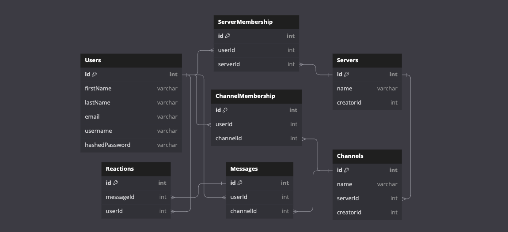

# babbl

## Database Schema Design


```
Table Users {
  id int [primary key]
  firstName varchar
  lastName varchar
  email varchar
  username varchar
  hashedPassword varchar
}

Table Servers {
  id int [primary key]
  name varchar
  creatorId int
}

Table Channels {
  id int [primary key]
  name varchar
  serverId int
  creatorId int
}

Table Messages {
  id int [primary key]
  userId int
  channelId int
}

Table Reactions {
  id int [primary key]
  messageId int
  userId int
}

Table ServerMembership {
  id int [primary key]
  userId int
  serverId int
}

Table ChannelMembership {
  id int [primary key]
  userId int
  channelId int
}

Ref: Users.id < ServerMembership.userId
Ref: Users.id < ChannelMembership.userId
Ref: Users.id < Reactions.userId
Ref: Users.id < Messages.userId
Ref: Servers.id < ServerMembership.serverId
Ref: Servers.id < Channels.serverId
Ref: Channels.id < ChannelMembership.channelId
Ref: Channels.id < Messages.channelId
Ref: Messages.id < Reactions.messageId
```
